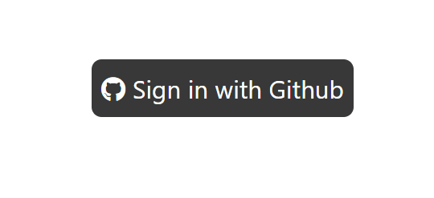
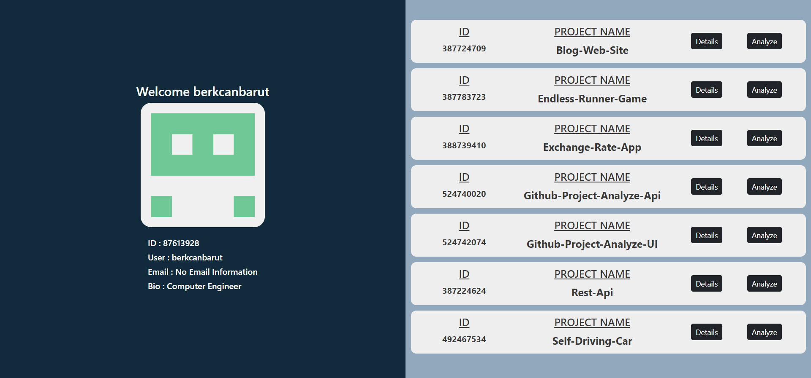
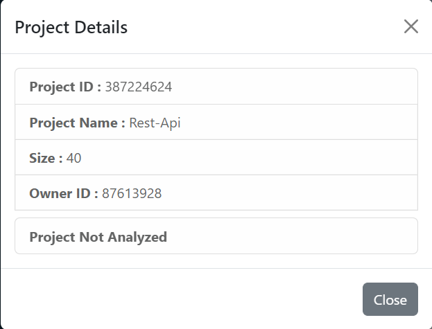
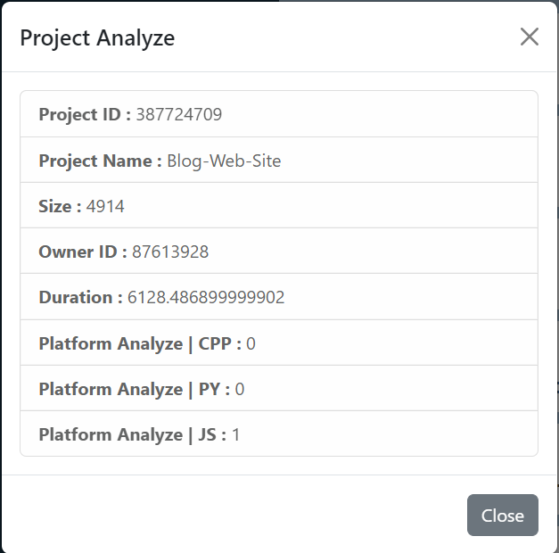

# Getting Started with Create React App

This project was bootstrapped with [Create React App](https://github.com/facebook/create-react-app).

This project was developed using the api in the link. | **[Github-Project-Analyze-Api](https://github.com/berkcanbarut/Github-Project-Analyze-Api)**

> # The User Interface
### A simple Web Interface will be written to use the API.
- The first page will be the login page, not the form, but the github login button.
- On the page that opens after the user logged in, a layout will be designed where the user
information on the left side of the screen and the project list on the right side where the
user can see the repositories allowed by the user. Repositories should be listed
depending on the organization. For this, a combobox to choose from among the
organizations should be added to the top of the list. You can write a custom component or
use a data table for the project list.

> ## Login Page

  

> ## User Page

  

> ## Project Details

  

> ## Project Analyze

  

